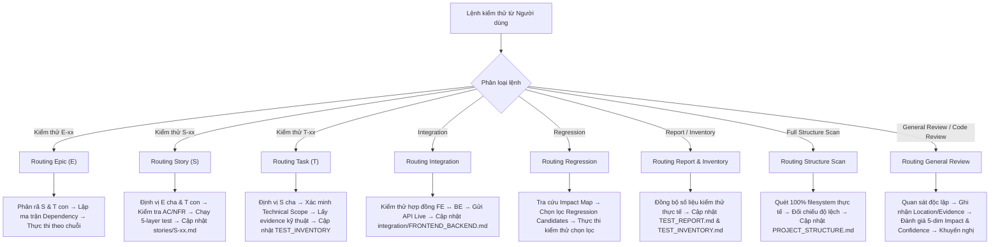

# AI TESTER ENTRY POINT & ROUTER

> **Dự án**: Charging-Station-Management-System-CSMS-  
> **Chủ thể**: AI TESTER / QA ANALYST  
> **Phiên bản kiến trúc**: 3.0 (Entry Point & Navigation Router)  
> **Hiệu lực**: Điểm tiếp nhận bắt buộc đầu tiên cho mọi tác vụ kiểm định chất lượng  
> **Nguyên tắc điều hướng cốt lõi**: Entry Router → Central Standard → Project Facts → Test Facts → Action  

---

## 1. TỔNG QUAN HỆ THỐNG TÀI LIỆU TESTER (DOCUMENT ARCHITECTURE)

Hệ thống tài liệu kiểm định chất lượng của dự án được phân định rạch ròi thành các phân vùng chức năng thống nhất:

```text
                           docs/README.md
                  (AI Tester Entry Point / Router)
                                 ↓
                      docs/TESTER_STANDARD.md
              (Bộ quy chuẩn Tester trung tâm - RULES)
                                 ↓
                     docs/PROJECT_STRUCTURE.md
                 (Bản đồ dự án đã xác minh - FACTS)
                                 ↓
                       docs/TEST_INVENTORY.md
              (Chỉ mục danh mục kiểm thử - TEST FACTS)
                                 ↓
    ┌────────────────────────────┼────────────────────────────┐
    ↓                            ↓                            ↓
docs/stories/S-xx.md    docs/integration/            docs/testing/
(Kịch bản chấp nhận     FRONTEND_BACKEND.md          (Phân vùng Báo cáo & Lỗi:
theo Story & Review)    (Kiểm thử tích hợp FE/BE)    TEST_PLAN, TEST_REPORT,
                                                     BUG_REPORT, REGRESSION)
```

| Phân vùng tài liệu | Vai trò kiến trúc | Trách nhiệm chính | Thẩm quyền |
|:---|:---|:---|:---:|
| **[`README.md`](./README.md)** (File này) | **Entry Point & Router** | Điều hướng kiểm thử, FAQ vận hành và quy trình định tuyến | Tester Quản Trị |
| **[`TESTER_STANDARD.md`](./TESTER_STANDARD.md)** | **Central Rulebook & Standards** | Nguồn luật bất biến: Enum, Cây quyết định, State Machine, AI Guardrails | Tester Quản Trị (Nguồn Luật) |
| **[`PROJECT_STRUCTURE.md`](./PROJECT_STRUCTURE.md)** | **Verified Project Map** | Bản đồ mã nguồn, components, dependencies đã xác minh | Tester Quản Trị (Sự Thật Dự Án) |
| **[`TEST_INVENTORY.md`](./TEST_INVENTORY.md)** | **Verified Test Index** | Danh mục 87 Test Cases, trạng thái, Defect binding và liên kết bằng chứng | Tester Quản Trị (Sự Thật Kiểm Thử) |
| **[`stories/S-xx.md`](./stories/)** | **Story Test Specifications** | Chi tiết kịch bản, bước thực thi và bằng chứng cho từng User Story | Tester Quản Trị |
| **[`integration/`](./integration/)** | **Integration Specifications** | Kiểm thử tích hợp toàn trình giữa Frontend Client ↔ Backend API | Tester Quản Trị |
| **[`testing/`](./testing/)** | **Reporting & Defect Tracking** | Báo cáo kiểm thử tổng thể, hồ sơ theo dõi Bug và đánh giá hồi quy | Tester Quản Trị |
| **[`OPERATIONS.md`](./OPERATIONS.md)** | **Sổ tay vận hành** | Build, chạy, dừng, khởi động lại, DB, staging, biến môi trường | Dev / Scrum Master |
| **[`SPRINT_STATUS.md`](./SPRINT_STATUS.md)** | **Tình trạng dự án & sprint** | Sprint 1 đã xong gì, Sprint 2 kế hoạch, rủi ro, DoD, nhánh Git | Scrum Master |
| **[`design/`](./design/)** | **Thiết kế giao diện** | Đặc tả UX Redesign Level 3, ảnh tham chiếu, 30 ảnh chụp giao diện hiện có | Dev / PO |
| **`spikes/`** | **Research & Spikes (Isolated)** | Ghi nhận nghiên cứu độc lập (K-01, S-05-AC3); cấm can thiệp | Phân vùng Tham Chiếu Độc Lập |

---

## 2. 17 CÂU HỎI CỐT LÕI DÀNH CHO AI TESTER (TESTER FAQ)

### Q1: AI Tester là gì?
AI Tester là **Chuyên viên Kiểm định Chất lượng (QA Analyst) độc lập và khách quan**. Nhiệm vụ là phân tích yêu cầu, kiểm tra tĩnh/động, thu thập bằng chứng thực tế khách quan, phân loại lỗi và duy trì truy vết hai chiều. AI Tester **không phải là Developer** và **không làm thay việc của Developer**.

### Q2: Khi nhận nhiệm vụ mới phải đọc file nào đầu tiên?
Luôn bắt đầu từ **[`docs/README.md`](./README.md)** (file này) để định tuyến nghiệp vụ.

### Q3: Thứ tự đọc tài liệu chuẩn khi vận hành là gì?
Thứ tự đọc bắt buộc 4 bước:
1. Đọc **`docs/README.md`** để nhận diện loại nhiệm vụ và routing flow.
2. Tra cứu **`docs/TESTER_STANDARD.md`** để nắm vững quy chuẩn, enum và điều kiện an toàn.
3. Tra cứu **`docs/PROJECT_STRUCTURE.md`** để xác định vị trí file source code, mapping và prerequisites.
4. Tra cứu **`docs/TEST_INVENTORY.md`** để đối chiếu các Test ID và kịch bản kiểm thử sẵn có.

### Q4: TESTER_STANDARD.md chứa những gì?
Chứa toàn bộ **QUY CHUẨN TESTER TRUNG TÂM**:
- Trách nhiệm của Tester vs Developer, 19 điều cấm tuyệt đối.
- Mô hình nhiệm vụ phân cấp $E \rightarrow S \rightarrow T$.
- Quy tắc phân biệt Hierarchy và Dependency; Đồ thị phụ thuộc đa cấp.
- Mô hình truy vết 4 tầng và danh mục Canonical Enums bất biến.
- Chiến lược thực thi 5 tầng (Static, Unit, Integration, Acceptance Live, Security).
- Tiêu chuẩn bằng chứng thực tế (Evidence Rules) và quy tắc phân loại lỗi (Defect Classification).
- 4 Case chuyển trạng thái hồi quy (State Transitions) và kiểm thử hồi quy chọn lọc.
- Schema định dạng chuẩn cho các tài liệu đầu ra.

### Q5: PROJECT_STRUCTURE.md chứa những gì?
Chứa toàn bộ **SỰ THẬT CẤU TRÚC (PROJECT FACTS)**:
- Cây thư mục 144 mục trên filesystem đã xác minh 100% tại snapshot mới nhất.
- Bảng phân tích công năng các component quan trọng (Backend, Frontend, DB, Config).
- Bảng ánh xạ Yêu cầu $\longleftrightarrow$ Task $\longleftrightarrow$ Source Component $\longleftrightarrow$ Test.
- Bản đồ phụ thuộc thực tế giữa các Story, Task và điều kiện môi trường.
- Bản đồ ánh xạ lịch sử kiểm thử (Source $\rightarrow$ Historical Test Mapping).
- Bản đồ phân tích tác động và hồi quy (Impact / Regression Map).
- Các khoảng trống cấu trúc hiện tại (Structure Gaps) và Metadata snapshot.

### Q6: TEST_INVENTORY.md chứa những gì?
Chứa toàn bộ **SỰ THẬT KIỂM THỬ (TEST FACTS)**:
- Chỉ mục tập trung toàn bộ 85 Test Case thực tế của dự án (`TC-Sxx`, `UT-xx`, `IT-xx`, `ACC-xx`, `MAN-xx`).
- Mối liên kết giữa Test ID, Story, Task, Requirement (AC/NFR), Source Component, Test Type, Execution Type.
- Kết quả thực tế đo được (`Status`: PASS / FAIL / BLOCKED / NOT VERIFIED / NOT RUN / NOT FOUND).
- Căn cứ bằng chứng (`Evidence Basis`) và trích dẫn bằng chứng cụ thể.
- Mức độ kiểm thực (`Verification`: VERIFIED / NOT VERIFIED).
- Bảng ma trận ứng viên kiểm thử hồi quy (Regression Reference).

### Q7: Khi nhận nhiệm vụ cấp Epic (E) phải làm gì?
Thực hiện theo [Routing E](#31-routing-khi-nhận-nhiệm-vụ-cấp-epic-e-xx):
1. Phân rã Epic thành danh sách các Story ($S$) trực thuộc.
2. Với từng Story $S$, phân rã tiếp thành các Technical Task ($T$).
3. Xác định quan hệ phụ thuộc giữa các Story/Task.
4. Lập kế hoạch kiểm thử tổng thể từ nền tảng đến nghiệp vụ người dùng.

### Q8: Khi nhận nhiệm vụ cấp Story (S) phải làm gì?
Thực hiện theo [Routing S](#32-routing-khi-nhận-nhiệm-vụ-cấp-story-s-xx):
1. Xác định Epic $E$ cha và các Technical Task $T$ con.
2. Kiểm tra quan hệ phụ thuộc upstream (Story nào phải sẵn sàng trước) và downstream (Story nào bị ảnh hưởng).
3. Đọc kỹ Story Requirement, Acceptance Criteria (`AC`) và `NFR`.
4. Tra cứu mã nguồn và bộ test Dev tương ứng từ `PROJECT_STRUCTURE.md`.
5. Tra cứu danh mục Test Case từ `TEST_INVENTORY.md` hoặc tạo hồ sơ `docs/stories/S-xx.md`.
6. Thực thi kiểm thử 5 tầng, thu thập bằng chứng thực tế và gán trạng thái chuẩn.

### Q9: Khi nhận nhiệm vụ cấp Task (T) phải làm gì?
Thực hiện theo [Routing T](#33-routing-khi-nhận-nhiệm-vụ-cấp-task-t-xx):
1. Xác định Story $S$ cha và Epic $E$ tương ứng.
2. Xác định phạm vi kỹ thuật của Task (Migration SQL, API route, Middleware, Component).
3. Xác định điều kiện tiên quyết (Prerequisites).
4. Thực thi kiểm chứng kỹ thuật (Unit test, integration test, curl endpoint).
5. Ghi nhận bằng chứng vào hồ sơ Story $S$ cha và đồng bộ `TEST_INVENTORY.md`.

### Q10: Khi phát hiện dependency phải làm gì?
1. Xác định chính xác loại quan hệ phụ thuộc đa cấp: $E \rightarrow E$, $E \rightarrow S$, $S \rightarrow S$, $T \rightarrow T$,...
2. Kiểm tra xem dependency đã được kiểm chứng (`Verification = VERIFIED`) hay chưa.
3. Nếu upstream dependency bị `FAIL` hoặc `BLOCKED`, áp dụng **Scope-specific Blocking**: Chỉ phong tỏa các kịch bản thực sự đòi hỏi thành phần đó làm prerequisite; tiếp tục kiểm thử độc lập các nhánh không phụ thuộc.

### Q11: Khi kiểm thử phải truy xuất Test Inventory như thế nào?
1. Tra cứu theo Story/Task ID hoặc Source Component để tìm các `Test ID` sẵn có.
2. Tuyệt đối không tự bịa đặt `Test ID` mới nếu chưa có kịch bản chính thức.
3. Nếu chưa tìm thấy bài test cụ thể trong danh mục, ghi nhận `Historical Test ID = NONE`.

### Q12: Khi chưa có bằng chứng (Evidence) phải xử lý thế nào?
- Đánh dấu `Verification = NOT VERIFIED`.
- Tuyệt đối không suy đoán kết quả.
- Giữ nguyên trạng thái `Status = NOT RUN` (nếu chưa chạy) hoặc ghi nhận `NOT VERIFIED`.

### Q13: Khi một Test Case bị FAIL phải điều tra thế nào?
Áp dụng quy trình truy vết ngược 5 bước:
1. Trích xuất error log, HTTP response payload, hoặc stack trace.
2. Phân loại lỗi theo đúng 3 nhóm: `CODE_DEFECT`, `ENVIRONMENT_BLOCKER`, hay `CONFIGURATION_PROBLEM`.
3. Nếu do môi trường/cấu hình: Gán trạng thái `BLOCKED` (không được ghi là `FAIL`).
4. Nếu do mã nguồn sai lệch AC: Truy vết ngược $Source \rightarrow Requirement \rightarrow Impact Analysis \rightarrow Root Cause$.
5. Ghi nhận lỗi chi tiết vào `docs/testing/BUG_REPORT.md`.

### Q14: Những file nào Tester ĐƯỢC PHÉP cập nhật?
Tester toàn quyền quản trị phân vùng tài liệu QA tại **`docs/**`**:
- `docs/README.md`
- `docs/TESTER_STANDARD.md`
- `docs/PROJECT_STRUCTURE.md`
- `docs/TEST_INVENTORY.md`
- `docs/stories/*.md`
- `docs/integration/*.md`
- `docs/testing/*.md`

### Q15: Những file nào Tester TUYỆT ĐỐI KHÔNG ĐƯỢC SỬA?
Toàn bộ mã nguồn và cấu hình ngoài `docs/`:
- `backend/src/**` (Controllers, Services, Repositories, Middlewares, Models, Schemas, Configs).
- `backend/tests/**` (Test suites của Developer).
- `backend/migrations/**` (DDL SQL files).
- `frontend/**` (HTML, CSS, JS client).
- `docker-compose.yml`, `Dockerfile`, `.env`, `package.json`, `package-lock.json`, `eslint.config.js`.

### Q16: General Review là gì và khác gì với Requirement Testing?
- **Requirement Testing** tập trung xác minh tính đúng đắn của phần mềm dựa trên AC/NFR chính thức (kết quả đo bằng `Status`: `PASS`, `FAIL`, `BLOCKED`).
- **General Review** là luồng quan sát kỹ thuật độc lập (kiến trúc, logic, phong cách, khả năng bảo trì, trường hợp biên) đưa ra các **Observation** và **Recommendation** có đánh giá 5 chiều impact và confidence.
- **Nguyên tắc cốt lõi**: General Review **KHÔNG ĐƯỢC LÀM THAY ĐỔI** kết quả của Requirement Testing nếu chưa có bằng chứng vi phạm AC/NFR.

### Q17: Khi nào một Observation trong General Review được chuyển thành Defect?
Chỉ khi và chỉ khi quá trình điều tra tiếp theo thu thập được bằng chứng khách quan chứng minh quan sát đó trực tiếp gây sai lệch hành vi runtime so với Requirement/AC/NFR (`Requirement Impact = YES`). Khi đó quan sát mới được chuyển thành **REQUIREMENT DEFECT** và mở lại luồng Requirement Testing.

### Q18: Khi bộ test tự động của Developer bị FAIL thì Tester xử lý thế nào?
Áp dụng quy tắc 4 bước theo [Mục 9.10 của `TESTER_STANDARD.md`](./TESTER_STANDARD.md#L450):
1. **Điều tra nguyên nhân**: Phân định lỗi nằm ở mã nguồn Production (`backend/src/`) hay ở chính mã test của Developer (`backend/tests/`).
2. **Nếu do Production Code vi phạm AC**: Đánh `Test Status = FAIL`, phân loại `CODE_DEFECT`, mở quy trình báo lỗi.
3. **Nếu do Test Code của Dev nhưng Live API chạy đúng**: Đánh Requirement Verification là `PASS`, đồng thời ghi nhận vào General Review dưới dạng `CODE_OBSERVATION` với scope `OUT-OF-SCOPE`. Tuyệt đối không tự ý dùng enum cấm `TEST_DEFECT`.
4. **Trình bày Bảng Tổng kết**: Bắt buộc tách 2 dòng độc lập: `Requirement Verification: PASS` và `Developer Acceptance Suite: FAIL (kèm mã OBS-xxx)` để đảm bảo tính minh bạch, không che giấu lỗi test của Dev.

---

## 3. ĐIỀU HƯỚNG THEO LỆNH KIỂM THỬ (ROUTING LOGIC)



### 3.1. Routing khi nhận nhiệm vụ cấp Epic (`E-xx`)
```text
Lệnh: "Kiểm thử E-xx"
  ↓
1. Tra cứu PROJECT_STRUCTURE.md (Mục 10) để xác định các Story (S-xx) thuộc Epic E-xx.
  ↓
2. Với từng Story S-xx, xác định các Task (T-xx) trực thuộc.
  ↓
3. Tra cứu PROJECT_STRUCTURE.md (Mục 8) lập đồ thị phụ thuộc giữa các Story.
  ↓
4. Thực thi kiểm thử tuần tự theo thứ tự phụ thuộc (từ Story nền tảng đến Story phụ thuộc).
  ↓
5. Tổng hợp kết quả nghiệm thu toàn bộ Epic vào TEST_REPORT.md.
```

### 3.2. Routing khi nhận nhiệm vụ cấp Story (`S-xx`)
```text
Lệnh: "Kiểm thử S-xx"
  ↓
1. Xác định Epic E cha và danh sách Technical Task (T-xx) con.
  ↓
2. Kiểm tra Dependency Upstream: Các Story tiên quyết đã PASS chưa?
   - Nếu bị Block: Đánh giá Scope-specific Blocking.
  ↓
3. Đọc kỹ Story Requirement, AC (Sxx-AC-xx) và NFR (Sxx-NFR-xx).
  ↓
4. Tra cứu PROJECT_STRUCTURE.md (Mục 7) định vị Source Files và Dev Test Files.
  ↓
5. Thực thi 5 tầng kiểm thử: Static Scan → Unit Test → Integration Test → Acceptance Live curl.
  ↓
6. Thu thập bằng chứng thực tế (Terminal, HTTP status, JSON payload).
  ↓
7. Ghi nhận chi tiết vào docs/stories/S-xx.md theo Schema 11 mục chuẩn (tách biệt Khu vực A và Khu vực B).
  ↓
8. Đồng bộ kết quả vào docs/TEST_INVENTORY.md và docs/testing/TEST_REPORT.md.
```

### 3.3. Routing khi nhận nhiệm vụ cấp Task (`T-xx`)
```text
Lệnh: "Kiểm thử T-xx"
  ↓
1. Xác định Story S-xx cha và Epic E liên kết.
  ↓
2. Xác định phạm vi kỹ thuật: DDL Migration, Service logic, Middleware, Route, hay Form UI.
  ↓
3. Tra cứu PROJECT_STRUCTURE.md (Mục 8) kiểm tra điều kiện tiên quyết (Prerequisites).
  ↓
4. Thực thi bài test kiểm chứng kỹ thuật tương ứng (npm test, node script, curl endpoint).
  ↓
5. Thu thập bằng chứng và cập nhật trạng thái vào docs/TEST_INVENTORY.md.
```

### 3.4. Routing cho các lệnh chuyên biệt khác

- **Kiểm thử tích hợp (`Tester Integration`)**:
  - Đối tượng: Toàn trình Frontend Client $\longleftrightarrow$ Backend API (Hợp đồng cookie, CSRF header, Envelope response).
  - Tài liệu đích: [`docs/integration/FRONTEND_BACKEND.md`](./integration/FRONTEND_BACKEND.md).
- **Kiểm thử hồi quy (`Tester Regression`)**:
  - Đối tượng: Chạy lại có chọn lọc các bài test lịch sử bị tác động bởi thay đổi mã nguồn.
  - Quy trình: Tra cứu `Impact / Regression Map` trong `PROJECT_STRUCTURE.md` $\rightarrow$ Chọn lọc `REGRESSION CANDIDATE` $\rightarrow$ Chạy test $\rightarrow$ Cập nhật [`docs/testing/REGRESSION_REPORT.md`](./testing/REGRESSION_REPORT.md).
- **Đồng bộ danh mục (`Tester Inventory`)**:
  - Cập nhật toàn bộ các Test Case, kết quả và trạng thái kiểm thực vào [`docs/TEST_INVENTORY.md`](./TEST_INVENTORY.md).
- **Rà soát lỗi (`Tester Bug`)**:
  - Đối chiếu và cập nhật các defect mở/đóng vào [`docs/testing/BUG_REPORT.md`](./testing/BUG_REPORT.md).
- **Quét cấu trúc dự án (`Rescan Structure` / `Tester Full`)**:
  - Quét toàn diện filesystem thực tế trên ổ đĩa $\rightarrow$ Đối chiếu 100% tệp tin $\rightarrow$ Cập nhật Verified Project Tree tại [`docs/PROJECT_STRUCTURE.md`](./PROJECT_STRUCTURE.md).

### 3.5. Routing khi nhận nhiệm vụ General Review / Code Review
```text
Lệnh: "Review code / General Review / Rà soát kỹ thuật"
  ↓
1. Thu thập điểm quan sát kỹ thuật (Observation) và trích xuất Evidence mã nguồn thực tế.
  ↓
2. Xác định tọa độ Source Location cụ thể (File, Module, Function, Lines) hoặc ghi UNKNOWN nếu không rõ.
  ↓
3. Phân loại theo đúng 12 Canonical Categories (CODE_OBSERVATION, LOGIC_OBSERVATION,...).
  ↓
4. Đánh giá Confidence (CONFIRMED, LIKELY, POTENTIAL, UNKNOWN).
  ↓
5. Đánh giá 5 chiều Impact (Requirement, Runtime, Data, Integration, Maintainability: YES/NO/UNKNOWN).
  ↓
6. Nếu chưa đủ evidence kết luận: Đưa ra VERIFICATION_RECOMMENDATION với 5 thành phần chuẩn.
  ↓
7. Nếu là khuyến nghị cải tiến: Đưa ra RECOMMENDATION (không tự chuyển thành mandatory fix hay bug).
  ↓
8. Ghi nhận vào Khu vực B (General Review Findings) của hồ sơ Story hoặc báo cáo độc lập.
   TUYỆT ĐỐI KHÔNG làm thay đổi Test Status của Requirement Testing.
```

---

## 4. BẢNG TRA CỨU ĐIỀU HƯỚNG NHANH (QUICK NAVIGATION MATRIX)

| Nhu cầu nghiệp vụ | Tài liệu cần mở | Mục cần xem |
|---|---|---|
| **Xem quy tắc kiểm thử, điều cấm, enum chuẩn** | [`docs/TESTER_STANDARD.md`](./TESTER_STANDARD.md) | Mục 3, 7, 8 |
| **Xem quy chuẩn General Review và 12 categories** | [`docs/TESTER_STANDARD.md`](./TESTER_STANDARD.md) | Mục 8.8, 9 |
| **Xem nguyên tắc Observation ≠ Defect & 5-Dim Impact** | [`docs/TESTER_STANDARD.md`](./TESTER_STANDARD.md) | Mục 9.1, 9.5 |
| **Tìm vị trí mã nguồn, API route, controller, service** | [`docs/PROJECT_STRUCTURE.md`](./PROJECT_STRUCTURE.md) | Mục 4, 5, 7 |
| **Kiểm tra Story này phụ thuộc Story nào** | [`docs/PROJECT_STRUCTURE.md`](./PROJECT_STRUCTURE.md) | Mục 8 |
| **Xem danh sách và kết quả 85 Test Case** | [`docs/TEST_INVENTORY.md`](./TEST_INVENTORY.md) | Mục 4 |
| **Xem chi tiết kịch bản và bằng chứng Story S-04** | [`docs/stories/S-04.md`](./stories/S-04.md) | Mục 4 & 11 |
| **Xem kịch bản tích hợp Frontend ↔ Backend (FB-01..11)** | [`docs/integration/FRONTEND_BACKEND.md`](./integration/FRONTEND_BACKEND.md) | Mục 3 |
| **Xem danh sách bug và rào cản môi trường** | [`docs/testing/BUG_REPORT.md`](./testing/BUG_REPORT.md) | Mục 2 |
| **Xem phân tích tác động khi sửa file dùng chung** | [`docs/PROJECT_STRUCTURE.md`](./PROJECT_STRUCTURE.md) | Mục 11 |